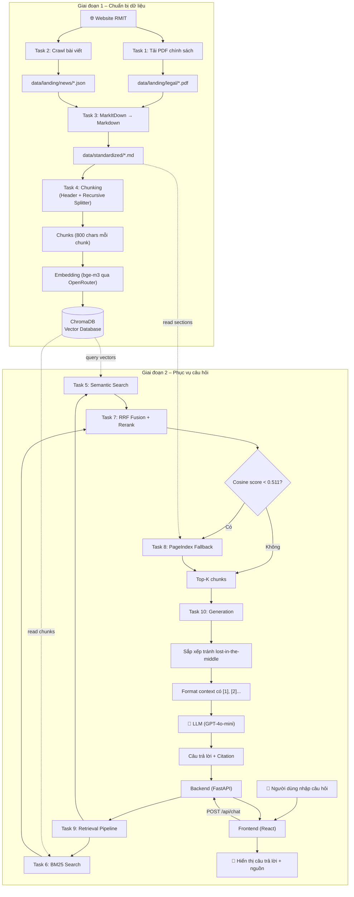

# 📘 Phân Tích Project: K3-Day08-RAG-Pipeline-Team-B4

> Báo cáo dành cho thành viên Frontend/Backend, giúp hiểu phần **Crawl dữ liệu** và **RAG Pipeline**.

---

## 1. Tổng quan project

### Project dùng để giải quyết vấn đề gì?

Đây là một **chatbot hỏi đáp thông minh** về dịch vụ đại học RMIT Vietnam (học phí, học bổng, ký túc xá, thư viện). Thay vì dùng LLM "bịa" câu trả lời, hệ thống **tìm kiếm trong dữ liệu thực** (PDF chính sách, bài viết trên web RMIT) rồi mới đưa vào LLM để sinh câu trả lời có trích dẫn nguồn — đây chính là kỹ thuật **RAG (Retrieval-Augmented Generation)**.

### Vai trò từng phần

| Thành phần | Vai trò |
|---|---|
| **Frontend** (React + Vite) | Giao diện chat, hiển thị câu trả lời + nguồn trích dẫn, quản lý theme |
| **Backend** (FastAPI) | API HTTP nhận câu hỏi từ frontend, gọi RAG pipeline, trả kết quả chuẩn hóa |
| **Crawler** (`src/task1`, `task2`) | Tải PDF chính sách + crawl bài viết từ website RMIT |
| **RAG Pipeline** (`src/task3`→`task10`) | Chuyển đổi → chia nhỏ → tạo vector → tìm kiếm → xếp hạng → sinh câu trả lời |

### Cấu trúc thư mục quan trọng

```
K3-Day08-RAG-Pipeline-Team-B4/
├── app.py                      # Streamlit UI (giao diện thay thế)
├── backend/
│   ├── main.py                 # FastAPI entry point
│   ├── config.py               # Cấu hình môi trường
│   ├── schemas.py              # Pydantic request/response models
│   └── services/rag.py         # Adapter gọi RAG pipeline
├── frontend/
│   └── src/
│       ├── App.tsx             # Component chính
│       ├── components/
│       │   ├── ChatWorkspace.tsx  # Giao diện chat
│       │   ├── SourcePanel.tsx    # Panel hiển thị nguồn
│       │   └── ...
│       ├── services/rag-client.ts # HTTP client gọi backend
│       └── types.ts               # TypeScript interfaces
├── src/
│   ├── task1_collect_legal_docs.py  # Tải PDF chính sách
│   ├── task2_crawl_news.py          # Crawl bài viết RMIT
│   ├── task3_convert_markdown.py    # Chuyển PDF/JSON → Markdown
│   ├── task4_chunking_indexing.py   # Chia nhỏ + tạo vector + lưu ChromaDB
│   ├── task5_semantic_search.py     # Tìm kiếm ngữ nghĩa (dense)
│   ├── task6_lexical_search.py      # Tìm kiếm từ khóa (BM25)
│   ├── task7_reranking.py           # Xếp hạng lại kết quả (RRF)
│   ├── task8_pageindex_vectorless.py # Tìm kiếm theo cấu trúc (fallback)
│   ├── task9_retrieval_pipeline.py  # Kết hợp tất cả retrieval
│   ├── task10_generation.py         # Gọi LLM sinh câu trả lời
│   └── embedding_client.py         # Client tạo embedding qua OpenRouter
├── data/
│   ├── landing/                    # Dữ liệu thô (PDF, JSON)
│   └── standardized/               # Dữ liệu đã chuyển sang Markdown
├── chroma_db/                       # Vector database (ChromaDB)
└── .env                             # API keys
```

---

## 2. Công nghệ đã sử dụng

| Công nghệ / Thư viện | Dùng ở file nào | Được sử dụng để làm gì |
|---|---|---|
| **React 19 + TypeScript** | `frontend/src/` | Xây giao diện chat, hiển thị nguồn trích dẫn |
| **Vite 8** | `frontend/vite.config.ts` | Dev server + build cho frontend |
| **Lucide React** | `frontend/src/components/*.tsx` | Icon library (Send, Bot, Sparkles…) |
| **FastAPI** | `backend/main.py` | Backend API (endpoint `/api/chat`, `/health`, `/api/documents`) |
| **Uvicorn** | `requirements.txt` | ASGI server chạy FastAPI |
| **Pydantic** | `backend/schemas.py` | Validate request/response (ChatRequest, RagResponse) |
| **Streamlit** | `app.py` | Giao diện chat thay thế (chạy độc lập, không qua FastAPI) |
| **requests** | `src/task1_collect_legal_docs.py`, `src/task2_crawl_news.py` | Tải PDF từ URL, crawl HTML từ website RMIT |
| **Crawl4AI** | `src/task2_crawl_news.py` | Crawl web bằng headless browser (ưu tiên nếu cài được) |
| **HTMLParser** (stdlib) | `src/task2_crawl_news.py` (class `RMITPageParser`) | Fallback parse HTML khi Crawl4AI không có |
| **MarkItDown** (Microsoft) | `src/task3_convert_markdown.py` | Chuyển PDF → Markdown |
| **LangChain Text Splitters** | `src/task4_chunking_indexing.py` | `MarkdownHeaderTextSplitter` + `RecursiveCharacterTextSplitter` để chia nhỏ văn bản |
| **BAAI/bge-m3** (qua OpenRouter) | `src/embedding_client.py` | Embedding model đa ngữ (1024 chiều, hỗ trợ cả tiếng Anh + Việt) |
| **ChromaDB** | `src/task4_chunking_indexing.py` | Vector database lưu trữ embedding, tìm kiếm cosine similarity |
| **rank-bm25** | `src/task6_lexical_search.py` | BM25Okapi — tìm kiếm từ khóa (lexical/sparse search) |
| **scikit-learn** | `src/task6_lexical_search.py` | TF-IDF vectorizer (ranker thay thế, bonus) |
| **OpenAI SDK** | `src/task5_semantic_search.py`, `src/task10_generation.py` | Gọi LLM qua OpenRouter (dùng OpenAI-compatible API) |
| **GPT-4o-mini** (hoặc model OpenRouter) | `src/task10_generation.py` | LLM sinh câu trả lời có citation |
| **PageIndex** | `src/task8_pageindex_vectorless.py` | Vectorless RAG — tìm kiếm theo cấu trúc tài liệu (fallback khi vector search kém) |
| **fpdf2** | `src/task8_pageindex_vectorless.py` | Chuyển Markdown → PDF để upload lên PageIndex API |
| **SQLite** | `src/embedding_client.py` | Cache embedding trên disk (tránh gọi API lặp lại) |

---

## 3. Cách crawl dữ liệu từ website

Project thu thập **2 loại dữ liệu** từ website RMIT Vietnam:

### 3.1. Thu thập văn bản chính sách (PDF)

> **File:** [task1_collect_legal_docs.py](file:///d:/code/AITHUCCHIEN/LAB/K3-Day08-RAG-Pipeline-Team-B4/src/task1_collect_legal_docs.py)

**URL được lấy từ đâu?**
- Hardcode 3 URL trực tiếp đến file PDF trên `rmit.edu.vn` — ở biến `LEGAL_DOCUMENTS` (dòng 33-61)

**3 file PDF được tải:**

| File | Nội dung |
|---|---|
| `student-fees-and-charges-guide-rmit-2026.pdf` | Học phí, phụ phí, phương thức thanh toán |
| `scholarship-terms-and-conditions-rmit.pdf` | Điều khoản học bổng |
| `accommodation-advice-international-students-rmit.pdf` | Hướng dẫn chỗ ở cho sinh viên quốc tế |

**Thư viện:** `requests` — gửi HTTP GET tải file PDF

**Quy trình:**
1. `setup_directory()` → tạo thư mục `data/landing/legal/`
2. `download_file()` → tải PDF qua HTTP, ghi vào file `.part` tạm, validate PDF header (`%PDF-`), rồi rename thành file chính thức
3. `is_valid_pdf()` → kiểm tra file > 1KB và bắt đầu bằng `%PDF-`
4. Nếu file đã tồn tại và hợp lệ → bỏ qua, không tải lại

**Đầu ra:** 3 file PDF trong `data/landing/legal/`

### 3.2. Crawl bài viết tin tức (HTML → JSON)

> **File:** [task2_crawl_news.py](file:///d:/code/AITHUCCHIEN/LAB/K3-Day08-RAG-Pipeline-Team-B4/src/task2_crawl_news.py)

**URL được lấy từ đâu?**
- Hardcode 5 URL bài viết RMIT trong biến `ARTICLE_URLS` (dòng 36-54)

**5 bài viết được crawl:**

| Bài | Chủ đề |
|---|---|
| article_01 | Học bổng RMIT 2026 |
| article_02 | Hướng dẫn sử dụng thư viện |
| article_03 | Careers Festival |
| article_04 | Dịch vụ hỗ trợ sinh viên quốc tế |
| article_05 | Student Academic Success |

**Thư viện crawl:** 
- **Ưu tiên:** `Crawl4AI` (headless browser) — hàm `crawl_article()` (dòng 224)
- **Fallback:** `requests` + `HTMLParser` — hàm `crawl_article_with_http()` (dòng 193)

**Nội dung được lấy:**
- Title (từ `<title>` hoặc `<meta og:title>`)
- Published date (từ `<meta article:published_time>`)
- Nội dung chính (từ thẻ `<main>` hoặc `<body>`) — chuyển thành Markdown

**Làm sạch nội dung:**
- Class `RMITPageParser` (dòng 97) — HTMLParser tùy chỉnh:
  - Bỏ qua `<script>`, `<style>`, `<nav>`, `<footer>`
  - Chuyển heading HTML → heading Markdown (`#`, `##`)
  - Chuyển `<li>` → bullet list (`- `)
- Hàm `normalise_markdown()` (dòng 79) — chuẩn hóa whitespace, loại bỏ dòng trống thừa

**Đầu ra:** 5 file JSON trong `data/landing/news/`, mỗi file chứa:
```json
{
  "url": "...",
  "title": "...",
  "published_date": "...",
  "date_crawled": "...",
  "content_markdown": "... (nội dung Markdown) ...",
  "crawler": "crawl4ai" hoặc "requests-htmlparser-fallback"
}
```

---

## 4. Cách xây dựng RAG

### Pipeline tổng quan

```text
Website RMIT
→ [Task 1] Tải 3 PDF chính sách
→ [Task 2] Crawl 5 bài viết HTML → JSON
→ [Task 3] Chuyển tất cả sang Markdown
→ [Task 4] Chia nhỏ → Tạo embedding → Lưu vào ChromaDB
```

### Bước 1: Chuyển đổi sang Markdown

> **File:** [task3_convert_markdown.py](file:///d:/code/AITHUCCHIEN/LAB/K3-Day08-RAG-Pipeline-Team-B4/src/task3_convert_markdown.py)

| | Chi tiết |
|---|---|
| **Function** | `convert_legal_docs()` (dòng 51) — chuyển PDF → MD bằng MarkItDown |
| | `convert_news_articles()` (dòng 77) — đọc JSON, ghép header + content → MD |
| **Công nghệ** | **MarkItDown** (Microsoft) cho PDF; **json** (stdlib) cho bài viết |
| **Đầu vào** | `data/landing/legal/*.pdf` + `data/landing/news/*.json` |
| **Đầu ra** | `data/standardized/legal/*.md` + `data/standardized/news/*.md` |

### Bước 2: Chia nhỏ văn bản (Chunking)

> **File:** [task4_chunking_indexing.py](file:///d:/code/AITHUCCHIEN/LAB/K3-Day08-RAG-Pipeline-Team-B4/src/task4_chunking_indexing.py) — hàm `chunk_documents()` (dòng 267)

| | Chi tiết |
|---|---|
| **Chiến lược** | 2 giai đoạn: `MarkdownHeaderTextSplitter` (chia theo heading) → `RecursiveCharacterTextSplitter` (chia theo kích thước) |
| **Tại sao 2 giai đoạn?** | Heading splitter giữ thông tin section (cho citation), nhưng 1 section có thể > 6000 ký tự — quá dài cho 1 chunk. Recursive splitter cắt cứng ở 800 ký tự |
| **CHUNK_SIZE** | 800 ký tự (~200-250 tokens) |
| **CHUNK_OVERLAP** | 100 ký tự (12.5%) — tránh câu bị cắt ngang giữa 2 chunks |
| **MIN_CHUNK_CHARS** | 80 — loại bỏ chunk quá ngắn (page number, dấu `---`) |
| **Tiền xử lý** | `promote_numbered_headings()` (dòng 141) — chuyển "4.2 Family Tuition fee" → `### 4.2 Family Tuition fee` (vì PDF không có heading Markdown) |
| | `clean_markdown()` (dòng 112) — loại bỏ mục lục (`.....`) và page footer |
| **Đầu vào** | List document dicts từ `load_documents()` |
| **Đầu ra** | List chunk dicts, mỗi chunk có `content`, `metadata` (source, section, chunk_index) |

### Bước 3: Tạo Embedding

> **File:** [embedding_client.py](file:///d:/code/AITHUCCHIEN/LAB/K3-Day08-RAG-Pipeline-Team-B4/src/embedding_client.py) — hàm `embed_texts()` (dòng 210)

| | Chi tiết |
|---|---|
| **Model** | `BAAI/bge-m3` (1024 chiều, đa ngữ) gọi qua **OpenRouter API** |
| **Tại sao bge-m3?** | Đa ngữ: hỏi tiếng Việt "Học phí bao nhiêu?" vẫn tìm được chunk tiếng Anh "Tuition fees" |
| **L2 normalize** | Vector được chuẩn hóa → cosine distance = `1 - cosine_similarity` |
| **Cache** | Lưu vector vào SQLite (`/.cache/embeddings.sqlite3`) — chạy lại không tốn API |
| **Batch** | 32 texts/request, có retry (5 lần, exponential backoff) |

### Bước 4: Lưu vào Vector Database

> **File:** [task4_chunking_indexing.py](file:///d:/code/AITHUCCHIEN/LAB/K3-Day08-RAG-Pipeline-Team-B4/src/task4_chunking_indexing.py) — hàm `index_to_vectorstore()` (dòng 406)

| | Chi tiết |
|---|---|
| **Vector DB** | **ChromaDB** (persistent, local, không cần Docker) |
| **Collection** | `university_services_docs` |
| **Distance metric** | `cosine` (`hnsw:space = cosine`) |
| **ID format** | `{source}::{chunk_index}` (vd: `student-fees-guide.md::42`) |
| **Batch size** | 200 chunks/lần upsert |
| **Đầu ra** | Thư mục `chroma_db/` chứa toàn bộ vectors + metadata |

---

## 5. Luồng khi người dùng đặt câu hỏi

### 5.1. Frontend gửi câu hỏi

> **Component:** [ChatWorkspace.tsx](file:///d:/code/AITHUCCHIEN/LAB/K3-Day08-RAG-Pipeline-Team-B4/frontend/src/components/ChatWorkspace.tsx) — form `composer` (dòng 343)

- Người dùng nhập câu hỏi vào `<textarea>`, nhấn Enter hoặc nút Send
- Hàm `onSubmit()` được gọi → trigger `submitQuery()` trong [App.tsx](file:///d:/code/AITHUCCHIEN/LAB/K3-Day08-RAG-Pipeline-Team-B4/frontend/src/App.tsx) (dòng 209)

### 5.2. Frontend gọi Backend API

> **Service:** [rag-client.ts](file:///d:/code/AITHUCCHIEN/LAB/K3-Day08-RAG-Pipeline-Team-B4/frontend/src/services/rag-client.ts) — class `HttpRagClient.query()` (dòng 149)

```typescript
// POST /api/chat
{
  message: "Học phí RMIT bao nhiêu?",
  conversation_id: "uuid...",
  top_k: 5,
  use_reranking: true
}
```

> [!NOTE]
> Nếu không cấu hình `VITE_RAG_API_URL`, frontend chạy ở **mock mode** — trả câu trả lời giả có sẵn, không gọi backend thật. Cần set `VITE_RAG_API_URL=same-origin` hoặc URL backend trong `.env.local`.

### 5.3. Backend nhận câu hỏi

> **Endpoint:** [backend/main.py](file:///d:/code/AITHUCCHIEN/LAB/K3-Day08-RAG-Pipeline-Team-B4/backend/main.py) — `POST /api/chat` (dòng 92-119)

- Validate request qua Pydantic schema `ChatRequest`
- Gọi `RagService.answer(request)` trong thread pool

### 5.4. RagService gọi RAG Pipeline

> **File:** [backend/services/rag.py](file:///d:/code/AITHUCCHIEN/LAB/K3-Day08-RAG-Pipeline-Team-B4/backend/services/rag.py) — `RagService.answer()` (dòng 41)

- Lazy import `generate_with_citation()` từ `src/task10_generation.py`
- Gọi `generator(request.message, top_k=request.top_k, use_reranking=request.use_reranking)`
- Chuẩn hóa kết quả thành `RagResponse` schema

### 5.5. Task 10 — Generation Pipeline

> **File:** [task10_generation.py](file:///d:/code/AITHUCCHIEN/LAB/K3-Day08-RAG-Pipeline-Team-B4/src/task10_generation.py) — `generate_with_citation()` (dòng 167)

```
Bước 1: retrieve(query, top_k=5)                → Lấy chunks liên quan (Task 9)
Bước 2: reorder_for_llm(chunks)                  → Sắp xếp tránh "lost in the middle"
Bước 3: format_context(reordered)                 → Format [1] Source: ... | Section: ...
Bước 4: Gọi LLM (GPT-4o-mini qua OpenAI/OpenRouter)
Bước 5: Return { answer, sources, retrieval_source }
```

### 5.6. Task 9 — Retrieval Pipeline (chi tiết)

> **File:** [task9_retrieval_pipeline.py](file:///d:/code/AITHUCCHIEN/LAB/K3-Day08-RAG-Pipeline-Team-B4/src/task9_retrieval_pipeline.py) — `retrieve()` (dòng 82)

```
Query: "Học phí RMIT bao nhiêu?"
  │
  ├── [Song song] semantic_search() (Task 5)     → Tìm bằng embedding cosine
  ├── [Song song] lexical_search() (Task 6)       → Tìm bằng BM25 keyword
  │
  ├── rerank_rrf([dense, sparse]) (Task 7)        → Merge 2 danh sách bằng RRF
  ├── rerank() (Task 7)                           → Rerank lần 2 (tuỳ config)
  │
  └── Kiểm tra: dense_results[0].score < 0.511?
        ├── CÓ  → pageindex_search() (Task 8)     → Fallback tìm theo cấu trúc
        └── KHÔNG → return kết quả hybrid
```

> [!IMPORTANT]
> **Bẫy quan trọng:** Score threshold dùng điểm **cosine gốc** từ semantic search, KHÔNG dùng điểm RRF. Vì điểm RRF luôn rất nhỏ (~0.016) bất kể query tốt hay xấu.

### 5.7. Response trả về Frontend

```json
{
  "answer": "Học phí được xác định theo chương trình... [1]\nĐể biết chi tiết... [2]",
  "sources": [
    {
      "id": "sha1_hash",
      "title": "student-fees-and-charges-guide-rmit-2026",
      "category": "LEGAL",
      "score": 0.032,
      "method": "Hybrid",
      "excerpt": "...",
      "content": "...",
      "year": 2026,
      "verified": true,
      "chunks": 1,
      "indexedAt": ""
    }
  ],
  "trace": {
    "steps": ["Semantic", "BM25", "Reranking", "LLM generation"],
    "latency": "2.34s",
    "mode": "hybrid"
  }
}
```

---

## 6. Luồng hoàn chỉnh của project

### Giai đoạn 1: Chuẩn bị dữ liệu (chạy 1 lần)

```text
[Task 1] Tải 3 PDF từ rmit.edu.vn → data/landing/legal/
[Task 2] Crawl 5 bài viết HTML → JSON → data/landing/news/
[Task 3] PDF → Markdown (MarkItDown), JSON → Markdown → data/standardized/
[Task 4] Markdown → Chunks (800 chars) → Embeddings (bge-m3) → ChromaDB
```

### Giai đoạn 2: Phục vụ câu hỏi (mỗi query)

```text
Người dùng hỏi → Frontend → POST /api/chat → FastAPI Backend
    → Task 9: Semantic Search + BM25 → RRF Fusion → Rerank
        → Nếu score thấp → Task 8: PageIndex Fallback
    → Task 10: Sắp xếp chunks → Format context → Gọi LLM
    → Backend chuẩn hóa → JSON Response → Frontend hiển thị
```

### Sơ đồ Mermaid



---

## 7. Những file tôi nên đọc

Đọc theo thứ tự từ trên xuống — từ cách thu thập dữ liệu đến cách trả lời câu hỏi:

| # | File | Nên đọc gì |
|---|---|---|
| 1 | [task1_collect_legal_docs.py](file:///d:/code/AITHUCCHIEN/LAB/K3-Day08-RAG-Pipeline-Team-B4/src/task1_collect_legal_docs.py) | Cách tải PDF từ URL. Chú ý hàm `download_file()` và `is_valid_pdf()` |
| 2 | [task2_crawl_news.py](file:///d:/code/AITHUCCHIEN/LAB/K3-Day08-RAG-Pipeline-Team-B4/src/task2_crawl_news.py) | Cách crawl HTML → Markdown. Chú ý class `RMITPageParser` (parse HTML) và hàm `crawl_article()` (ưu tiên Crawl4AI, fallback HTTP) |
| 3 | [task3_convert_markdown.py](file:///d:/code/AITHUCCHIEN/LAB/K3-Day08-RAG-Pipeline-Team-B4/src/task3_convert_markdown.py) | Cách chuyển PDF/JSON → Markdown thống nhất. Chú ý `convert_legal_docs()` dùng MarkItDown, `convert_news_articles()` đọc JSON + ghép header |
| 4 | [embedding_client.py](file:///d:/code/AITHUCCHIEN/LAB/K3-Day08-RAG-Pipeline-Team-B4/src/embedding_client.py) | Cách tạo embedding qua OpenRouter API + cache SQLite. Chú ý `embed_texts()`, `_l2_normalize()`, `_post_embeddings()` |
| 5 | [task4_chunking_indexing.py](file:///d:/code/AITHUCCHIEN/LAB/K3-Day08-RAG-Pipeline-Team-B4/src/task4_chunking_indexing.py) | **File quan trọng nhất phía RAG.** Chú ý `chunk_documents()` (2-stage chunking), `promote_numbered_headings()` (xử lý PDF không có heading), `index_to_vectorstore()` (lưu ChromaDB) |
| 6 | [task9_retrieval_pipeline.py](file:///d:/code/AITHUCCHIEN/LAB/K3-Day08-RAG-Pipeline-Team-B4/src/task9_retrieval_pipeline.py) | Cách kết hợp tìm kiếm. Chú ý `retrieve()` — chạy song song semantic + BM25, fuse bằng RRF, kiểm tra threshold → fallback |
| 7 | [task10_generation.py](file:///d:/code/AITHUCCHIEN/LAB/K3-Day08-RAG-Pipeline-Team-B4/src/task10_generation.py) | Cách sinh câu trả lời. Chú ý `generate_with_citation()`, `reorder_for_llm()` (sắp xếp tránh lost-in-the-middle), `SYSTEM_PROMPT` (yêu cầu LLM trả lời có citation) |
| 8 | [backend/services/rag.py](file:///d:/code/AITHUCCHIEN/LAB/K3-Day08-RAG-Pipeline-Team-B4/backend/services/rag.py) | Adapter giữa FastAPI và RAG pipeline. Chú ý `RagService.answer()` (gọi Task 10, chuẩn hóa output), `_normalize_source()` (chuyển raw dict → SourceDocument) |
| 9 | [backend/main.py](file:///d:/code/AITHUCCHIEN/LAB/K3-Day08-RAG-Pipeline-Team-B4/backend/main.py) | FastAPI endpoints. Chú ý `chat()` endpoint (POST /api/chat), `health()`, `documents()` |
| 10 | [frontend/src/services/rag-client.ts](file:///d:/code/AITHUCCHIEN/LAB/K3-Day08-RAG-Pipeline-Team-B4/frontend/src/services/rag-client.ts) | Cách frontend gọi backend. Chú ý class `HttpRagClient` (gọi thật) vs `MockRagClient` (demo mode), biến `isMockMode` |

---

## 8. Tóm tắt để trình bày lại

### Project hoạt động như thế nào?

Project xây dựng một **chatbot RAG** cho dịch vụ đại học RMIT Vietnam. Thay vì để LLM tự bịa đáp án, hệ thống **tìm kiếm trong kho dữ liệu thật** (PDF chính sách, bài viết RMIT) rồi đưa dữ liệu liên quan vào LLM để sinh câu trả lời **có trích dẫn nguồn** (citation [1], [2]...).

### Dữ liệu được crawl và đưa vào RAG ra sao?

1. **Task 1:** Tải 3 file PDF chính sách từ website RMIT (học phí, học bổng, chỗ ở)
2. **Task 2:** Crawl 5 bài viết tin tức từ RMIT bằng Crawl4AI hoặc requests
3. **Task 3:** Chuyển tất cả về format Markdown thống nhất bằng MarkItDown
4. **Task 4:** Chia Markdown thành các đoạn nhỏ 800 ký tự (chunking 2 giai đoạn: theo heading rồi theo kích thước), tạo embedding 1024 chiều bằng model bge-m3, lưu vào ChromaDB

### Khi người dùng hỏi, hệ thống tìm dữ liệu và trả lời như thế nào?

1. **Tìm kiếm hybrid:** Chạy song song **semantic search** (tìm theo nghĩa bằng embedding) và **BM25** (tìm theo từ khóa)
2. **Merge + Rerank:** Kết hợp 2 danh sách bằng **RRF** (Reciprocal Rank Fusion) — chỉ dùng thứ hạng, không so sánh điểm khác thang
3. **Fallback:** Nếu điểm cosine cao nhất < 0.511 (query lạc đề) → chuyển sang **PageIndex** (tìm theo cấu trúc tài liệu, không dùng vector)
4. **Generation:** Sắp xếp chunks (tránh lost-in-the-middle), đưa vào prompt cùng câu hỏi, gọi **GPT-4o-mini** để sinh câu trả lời có citation

### Những công nghệ quan trọng nhất

| Công nghệ | Vai trò |
|---|---|
| **bge-m3** (BAAI) | Embedding đa ngữ — cầu nối giữa câu hỏi tiếng Việt và dữ liệu tiếng Anh |
| **ChromaDB** | Vector database lưu trữ và tìm kiếm embedding |
| **LangChain Text Splitters** | Chia nhỏ văn bản thông minh (theo heading + kích thước) |
| **BM25** (rank-bm25) | Tìm kiếm từ khóa — bổ sung cho semantic search |
| **RRF** (Reciprocal Rank Fusion) | Kết hợp kết quả từ nhiều phương pháp tìm kiếm |
| **GPT-4o-mini** | LLM sinh câu trả lời có citation |
| **FastAPI** | Backend API kết nối frontend với RAG pipeline |
| **React + Vite** | Frontend giao diện chat |

---

> [!TIP]
> Để chạy thử nhanh toàn bộ pipeline mà không cần frontend:
> ```bash
> python -m src.task1_collect_legal_docs    # Tải PDF
> python -m src.task2_crawl_news            # Crawl bài viết
> python -m src.task3_convert_markdown      # Chuyển sang Markdown
> python -m src.task4_chunking_indexing     # Chunk + Embed + Index
> python -m src.task10_generation           # Test hỏi đáp
> ```
